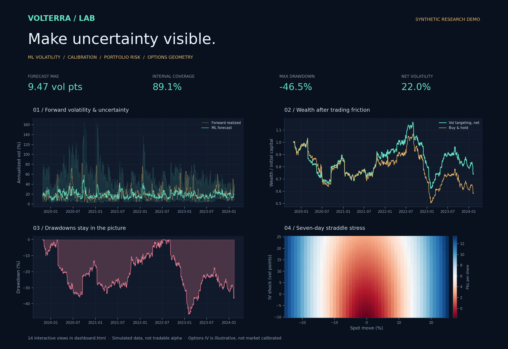

# VOLTERRA / LAB

**Make uncertainty visible.**



A quantitative research workbench connecting machine learning volatility forecasts, empirical uncertainty, portfolio risk and options geometry. The output is a standalone dark-theme HTML dashboard with **14 interactive charts**, full experiment metadata and an audit trail of every chronological split.

This is an original research implementation, not a claim of new financial theory or trading alpha. The default run uses synthetic prices. Imported market data is supported through CSV. No live orders or broker integration are included.

## Run the research desk

Python 3.10+:

```bash
python3 -m venv .venv
source .venv/bin/activate
pip install -e .
volterra-lab demo --out artifacts/demo
```

Open `artifacts/demo/dashboard.html` in a modern browser. Plotly JavaScript is embedded; the report does not require a web server, a CDN or internet access. Hover, zoom, toggle series, rotate the 3D surface, and switch between assumed IV, call value, gamma and vega.

## What is in the dashboard?

| Research area | Views |
| --- | --- |
| Market and forecasting | Price history; realized volatility versus model and interval; rolling coverage; prediction scatter |
| Model diagnostics | QLIKE baseline comparison; error distribution; paired block-bootstrap confidence intervals |
| Portfolio risk | Net wealth versus buy-and-hold; drawdowns; deployed exposure |
| Options | Interactive volatility/price/Greek surface; seven-day straddle stress heatmap; Greeks through spot |
| Research controls | Training/calibration/test boundary chart |

## Use your own prices

```bash
volterra-lab run --csv private-data/prices.csv --horizon 5 --cost-bps 5 --out artifacts/market-run
```

Input columns are `date,close`, sorted from oldest to newest with unique dates and positive prices. Supply at least 700 daily trading observations. Price data must use a consistent adjustment convention: splits can otherwise look like huge returns. Dividend treatment follows your input series. No automatic corporate-action adjustments or exchange-calendar validation are performed. Intraday and irregularly sampled inputs are not supported by the 252-observation annualization assumption.

The simulation uses regime-switching stochastic volatility, heavy-tailed innovations and occasional jumps. It is a stress-test fixture, not a fitted market model. Its labels are never mixed with imported prices.

## Forecasting design

The target at observation t is annualized realized volatility over returns t+1 through t+h. Features use only data available through t: trailing 5/10/21/63-observation realized volatility, absolute return, downside volatility, momentum and drawdown.

Three forecasts are reported:

1. Histogram gradient boosting trained on log realized volatility.
2. Standardized ridge regression trained on the same log target and historical rows.
3. Trailing 21-observation realized volatility, a deliberately simple benchmark.

Models use fixed settings, expanding training samples, a separate 100-origin calibration window, and refits every 21 origins. A label must finish **before** the next calibration or test block begins. `audit.json` records these boundaries. Calibration residuals are not used to fit the model. No test-based hyperparameter search or model selection occurs.

Absolute log-residuals set the nominal 90% split-conformal interval using a finite-sample order statistic. Forward targets overlap and returns are serially dependent, so standard exchangeability guarantees do not apply. Coverage and width are measured and shown; the report does not promise 90% future coverage.

QLIKE is evaluated on predicted and realized variance: ratio − log(ratio) − 1. Paired losses are compared using 1,000 circular moving-block bootstrap draws with block length 21. These intervals preserve some local dependence but do not remove regime-change or model-selection uncertainty. Log-target back-transforms behave like conditional medians; they are not bias-corrected conditional means.

## Portfolio experiment

The illustrative strategy targets 15% annual volatility by scaling long exposure to the model forecast, with a 1.5× cap and a 3% forecast floor. A forecast observed at t is implemented at the t+1 close and first earns the t+2 close-to-close return. Costs are charged at the implementation close, at 5 bps per unit turnover by default. Borrowing above 1× costs 5% annually; idle cash earns zero.

The strategy is a diagnostic, not a recommendation. It omits taxes, market impact, changing funding rates, instrument-specific margin and liquidation mechanics. Buy-and-hold is a passive gross benchmark. Daily trading constraints and slippage can differ materially in practice. The target volatility is not guaranteed to be achieved.

## Options laboratory

European Black–Scholes prices, put-call parity, delta, gamma, vega per volatility point and theta per calendar day are implemented. The surface uses an **assumed** IV anchor equal to the final evaluated realized-vol forecast plus 4 volatility points, with a chosen skew and term-structure formula.

This is not a quoted or market-calibrated IV surface. Realized volatility forecasts and risk-neutral implied volatility are different quantities; the premium here is an explicit illustration. The surface is not certified arbitrage-free. Early exercise, discrete dividends, stochastic rates and transaction costs are omitted.

The scenario anchor is the last evaluated forecast origin, not today's market. The stress map reprices an ATM 30-day long straddle after seven calendar days, over spot and IV shocks. Values and P&L are per underlying share, before fees and contract multipliers.

## Reproducibility and honest results

Each run writes:

- `dashboard.html`: standalone interactive research report.
- `metrics.json`: model, interval and strategy diagnostics, dependency versions and input SHA-256.
- `audit.json`: every training/calibration/test boundary.
- `forecasts.csv`: held-out forecasts, realized targets, positions, turnover and net returns.
- `prices.csv`: the exact run input.

The seeded 1,600-observation demo is not tuned to look profitable. In the validated run, ridge regression beats gradient boosting on QLIKE; the volatility-targeting experiment has a negative annualized return and material drawdown. The dashboard shows this openly. Do not infer tradable alpha from synthetic results.

```bash
python -m unittest discover -s tests -v
```

Tests check future-data invariance, label purging, target construction, calibration quantiles, execution delay, transaction costs, bootstrap behavior, put-call parity and finite-difference Greeks. CI runs the tests and a small report build.

## Layout

- `research.py`: prices, features, walk-forward models, calibration, bootstrap and portfolio experiment.
- `options.py`: analytical European-option prices, Greeks and scenario grids.
- `dashboard.py`: the self-contained interactive research canvas.
- `cli.py`: reproducible demo and imported-data workflows.

MIT License. The project and reports are research material, not investment advice.

Preview regeneration: `pip install -e ".[preview]"` then `python scripts/render_preview.py --run artifacts/demo`.
